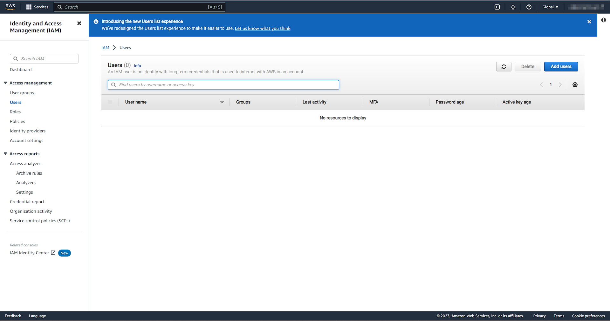
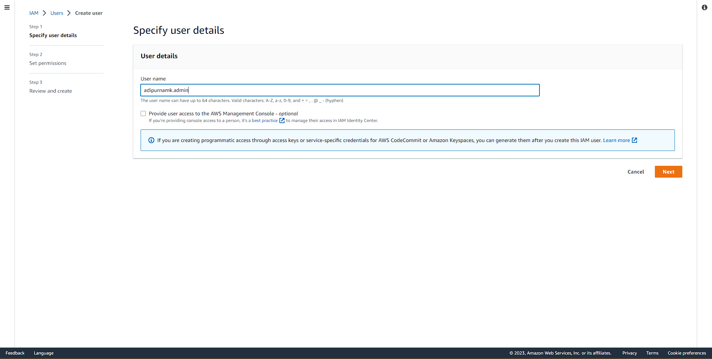
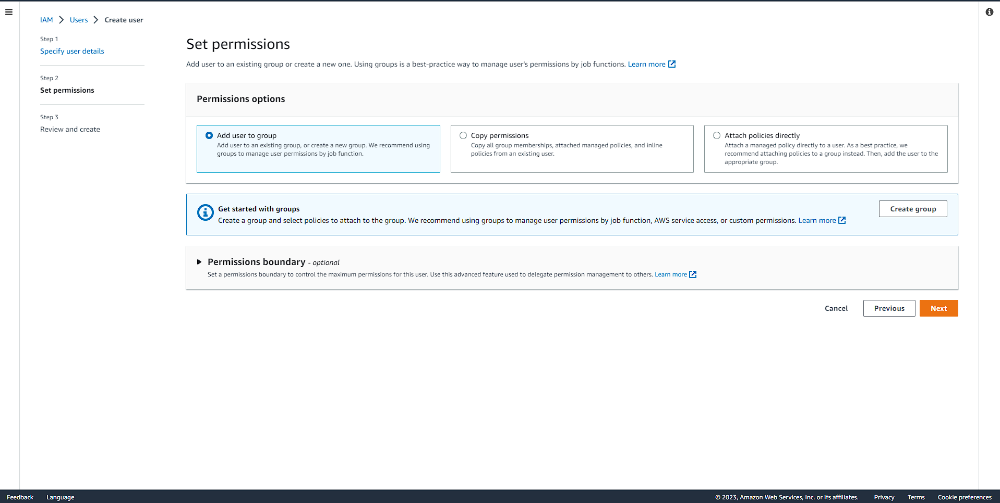
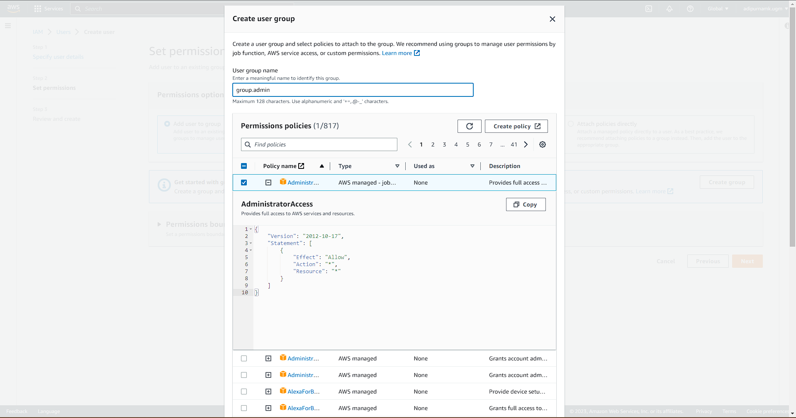
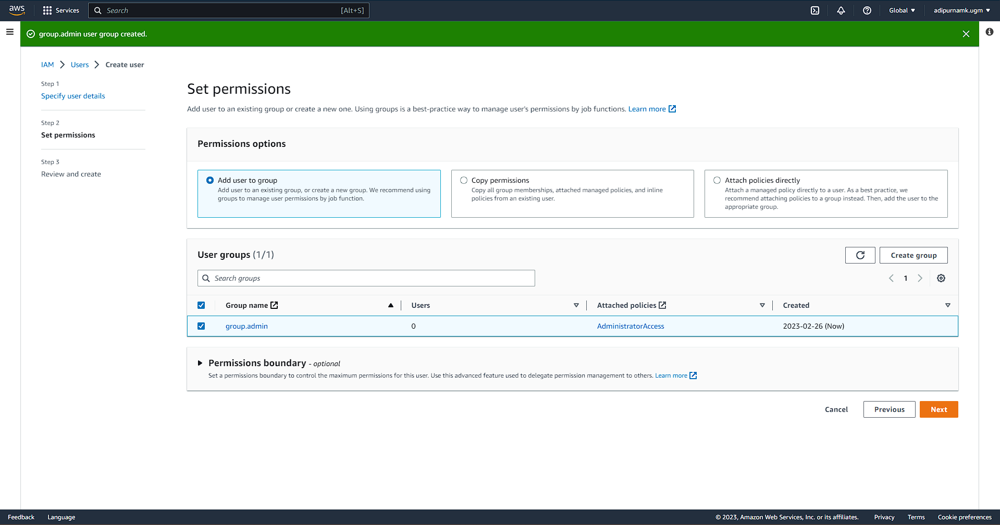
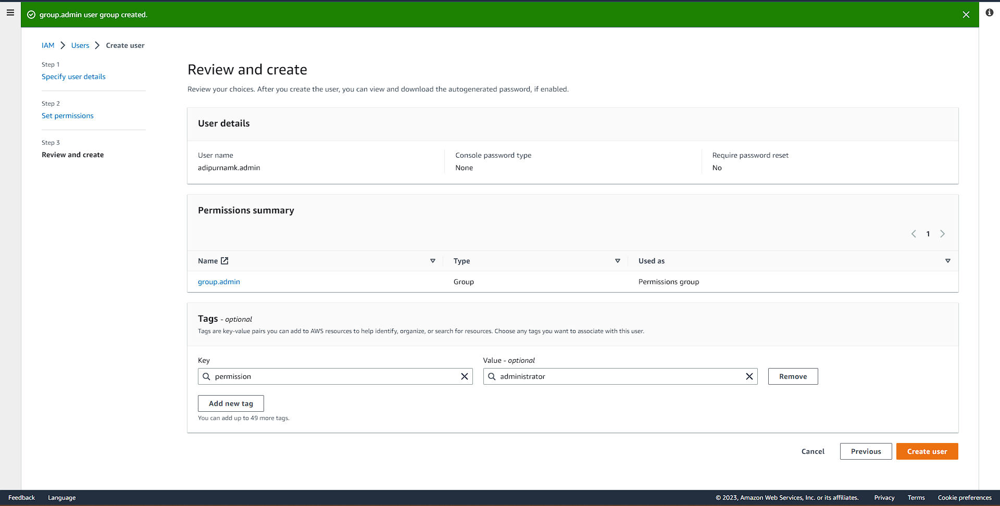
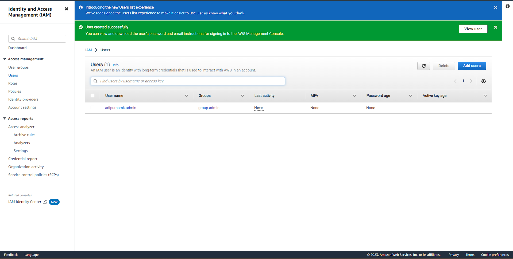
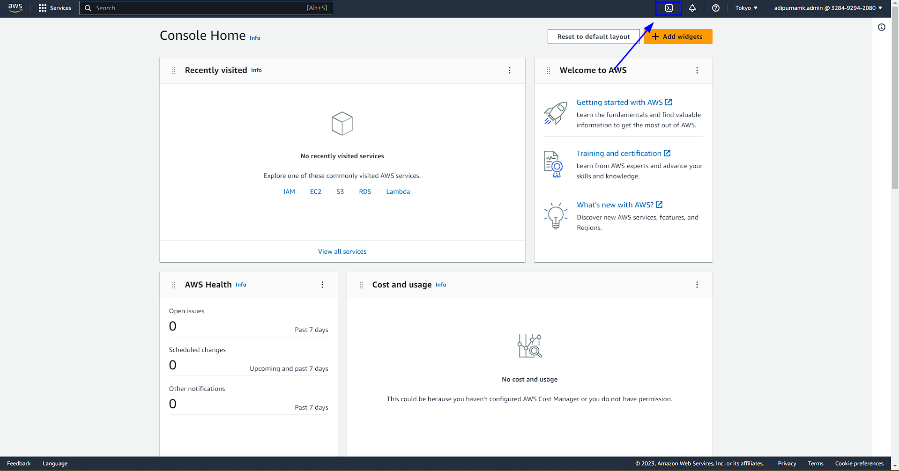
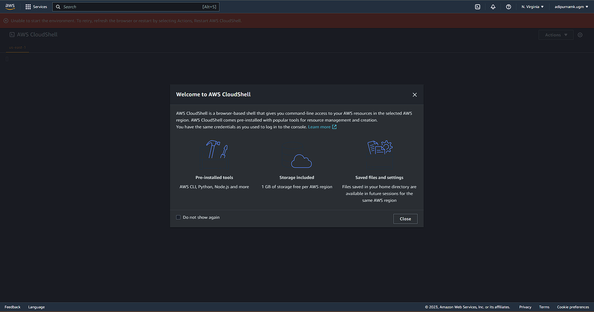
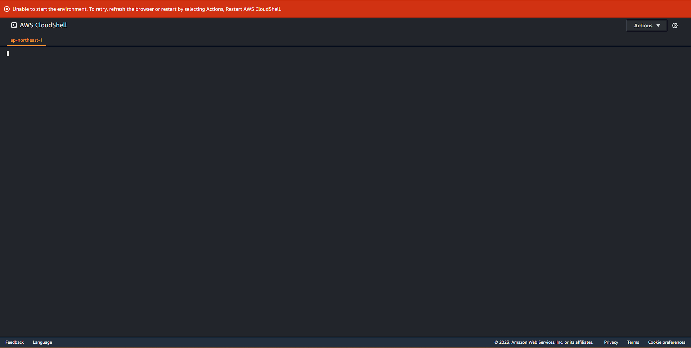

# Week 0 — Billing and Architecture

## Logical Architectual Diagram in Lucid Charts
https://lucid.app/lucidchart/f66a78bf-14fd-40d8-a1fc-e65645e223aa/view?page=0_0&invitationId=inv_c5c78108-6652-4ae0-8b97-3dae65bd2cae#

---

## Security Consideration
## Create an Admin User
From Search Bar, search for IAM to make a new Admin user.	

Insert desired Admin User name.

Choosing permission, for the best practice we'll make a new 'admin group', set permission and add new admin user into this group.

Make a new group with defined administrator permission.

Choose created group to our admin user.

Add tag for better audit.

Finished. An Admin User has been created.

## Use CloudShell	
To open AWS Cloudshell, you can click Terminal icon on the left side of notification icon, on the top bar.

Welcome to AWS Cloudshell!

If you have facing "Unable to start the environment. To retry, refresh the browser or restart by selecting Actions, Restart AWS CloudShell." error. Please refer this [documentation](https://repost.aws/questions/QUH54A371dRvej5J1G_yZogw/error-when-launching-aws-cloud-shell-unable-to-start-the-environment) and change your region.

## Generate AWS Credentials

## Installed AWS CLI
Before we can use Cloudshell, we need to install AWS CLI first. Since I'm using Ubuntu (WSL based), we'll install based on [Installing or updating the latest version of the AWS CLI](https://docs.aws.amazon.com/cli/latest/userguide/getting-started-install.html).

## Create a Billing Alarm	
## Create a Budget	

---

## Challange
