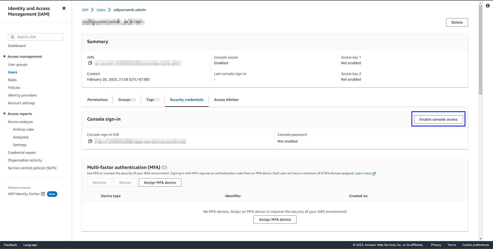
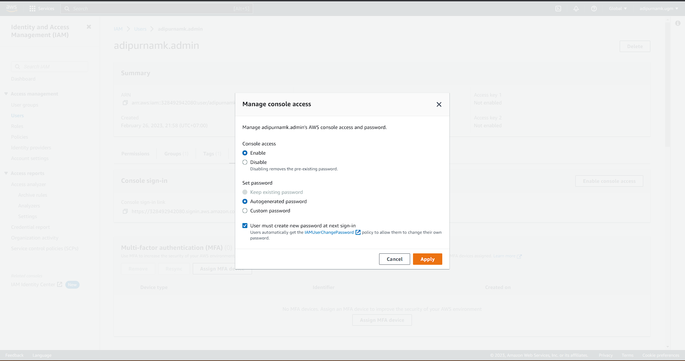
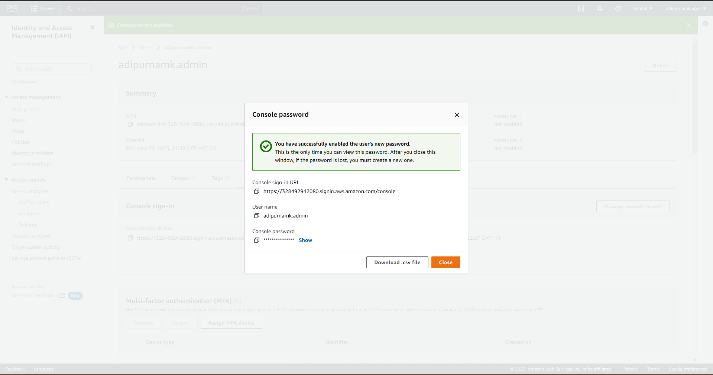
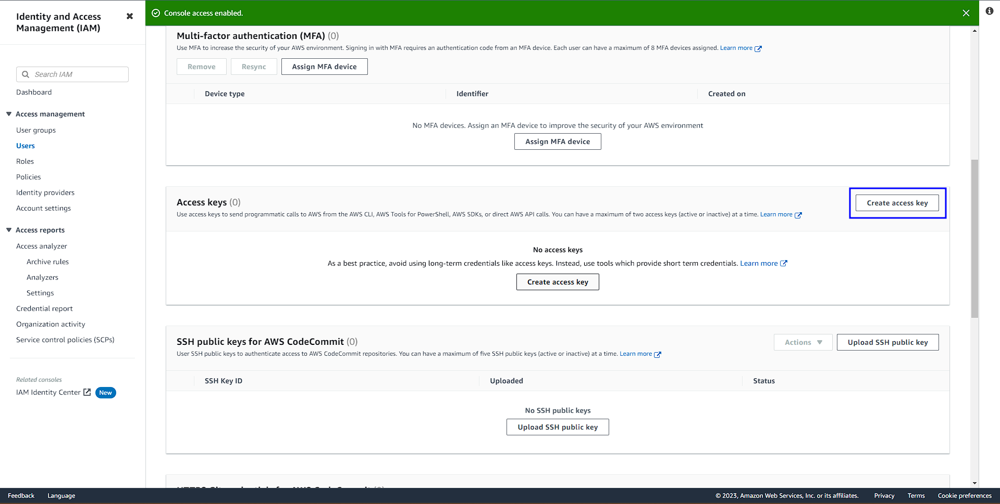
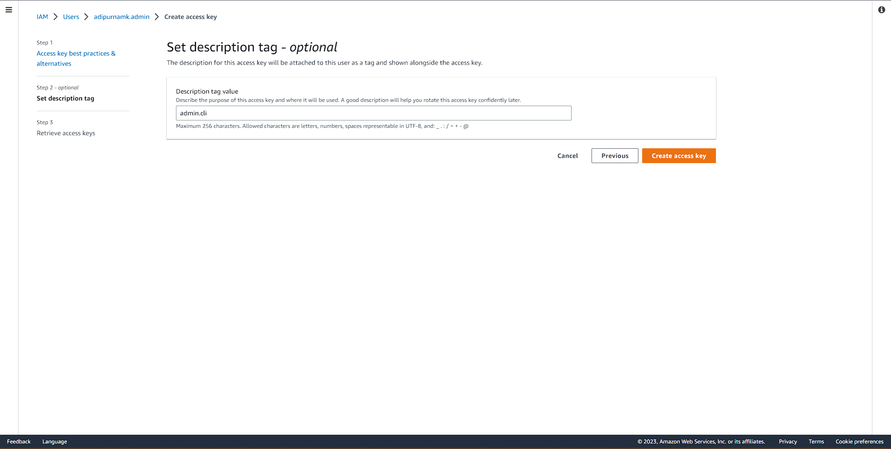
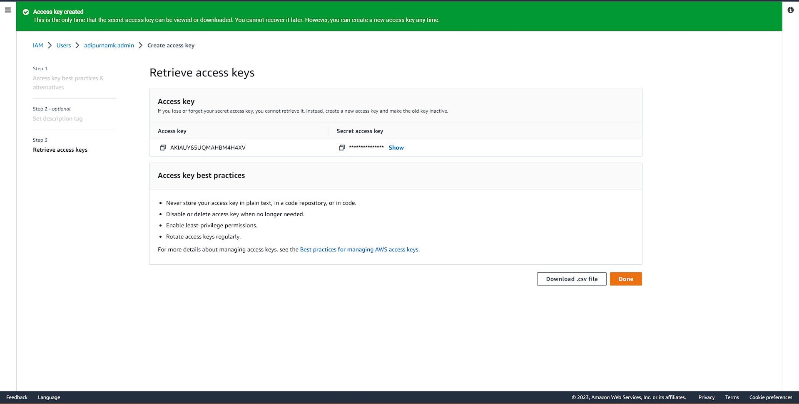
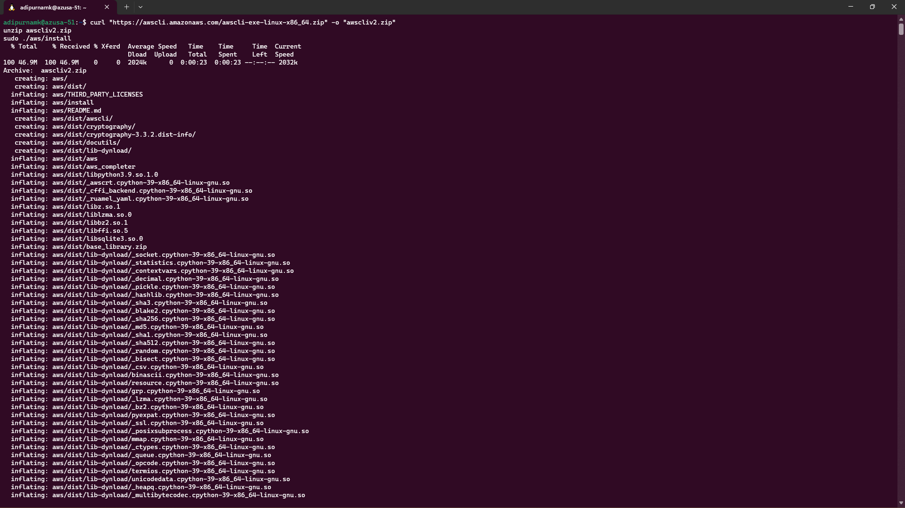
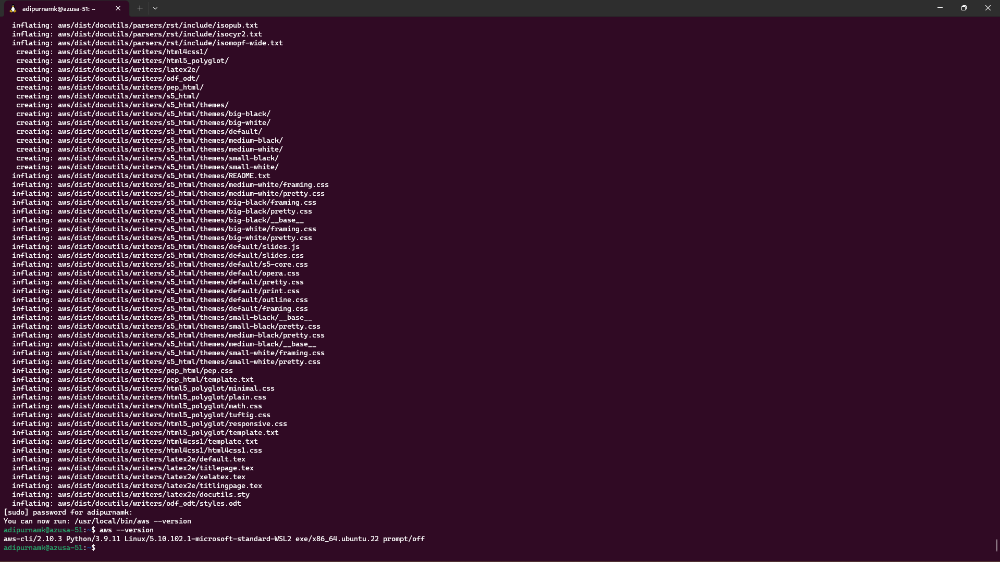
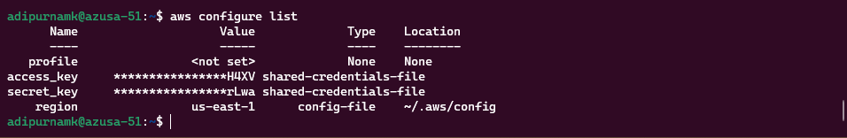

# Week 0 — Billing and Architecture

## Logical Architectual Diagram in Lucid Charts
https://lucid.app/lucidchart/f66a78bf-14fd-40d8-a1fc-e65645e223aa/view?page=0_0&invitationId=inv_c5c78108-6652-4ae0-8b97-3dae65bd2cae#

---

## Security Consideration
## Create an Admin User
From Search Bar, search for IAM to make a new Admin user.	

Insert desired Admin User name.

Choosing permission, for the best practice we'll make a new 'admin group', set permission and add new admin user into this group.

Make a new group with defined administrator permission.

Choose created group to our admin user.

Add tag for better audit.

Finished. An Admin User has been created.


## Use CloudShell	
To open AWS Cloudshell, you can click Terminal icon on the left side of notification icon, on the top bar.

Welcome to AWS Cloudshell!

If you facing "Unable to start the environment. To retry, refresh the browser or restart by selecting Actions, Restart AWS CloudShell." error. Please refer this [documentation](https://repost.aws/questions/QUH54A371dRvej5J1G_yZogw/error-when-launching-aws-cloud-shell-unable-to-start-the-environment) and change your region.


## Generate AWS Credentials
### Generate Console Access
To enable Console Access, you can click Enable Console Access in IAM > User > Security credentials tab.

Set your preference, choose Enable console access. 

Download .csv.


### Generate AWS CLI Access
To enable AWS CLI, AWS Tools for PowerShell, AWS SDKs, or direct AWS API calls, you can click Enable Console Access in IAM > User > Security credentials tab.

Choose Command Line Interface (CLI).

Add tag by your preference.

Download .csv.


## Install AWS CLI
We need to install AWS CLI first. Since I'm using Ubuntu (WSL based), we'll install based on [Installing or updating the latest version of the AWS CLI](https://docs.aws.amazon.com/cli/latest/userguide/getting-started-install.html).

```
curl "https://awscli.amazonaws.com/awscli-exe-linux-x86_64.zip" -o "awscliv2.zip"
unzip awscliv2.zip
sudo ./aws/install
```


Check AWS CLI installation using 'aws --version' command.

Configure AWS CLI using 'aws configure' and check running configuration using 'aws configure list'.


## Create a Billing Alarm	
## Create a Budget	

---

## Challange
